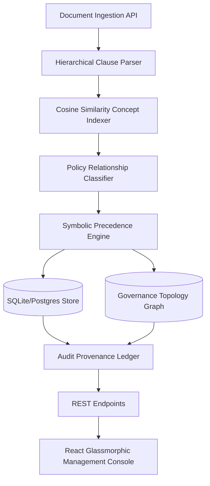

# Enterprise Policy Relationship Intelligence System (Semantic Audit Memory)
## Production-Grade Architecture & Deployment Blueprint

This document details the complete design, data structures, deployment, and testing workflows for the Enterprise Policy Relationship Intelligence System (Semantic Audit Memory). It describes a deterministic, CPU-first on-premises compliance governance intelligence platform.

---

## 1. System Architecture Diagram



---

## 2. Project Folder Structure

```
LEO-main/
├── backend/
│   ├── core/
│   │   ├── database.py             # SQLite/SQLAlchemy schemas
│   │   ├── policy_system.py        # Clause parser, similarity indexer, override resolver
│   │   └── leo_orchestrator.py     # 11-Layer OMEGA Operating System
│   └── main.py                     # FastAPI REST Endpoints & Cors Config
├── ui_core/
│   ├── lib/
│   │   └── api.ts                  # Axios/Fetch client integration
│   └── pages/
│       └── LeoOrchestrationMaster.tsx # React Compliance & Contradiction Console
├── tests/
│   ├── test_policy_system.py       # Core Engine Unit Tests
│   └── test_api.py                 # REST API Integration Tests
├── Dockerfile                      # Multistage CPU-optimized Dockerfile
├── docker-compose.yml              # Local air-gapped services compose stack
└── GOVERNANCE_ARCHITECTURE.md      # Architecture, Schema, and Roadmap Blueprint (This File)
```

---

## 3. Database & Graph Schemas

### relational SQL schema (database.py)
1. **policy_documents**
   - `id`: INTEGER (Primary Key)
   - `filename`: VARCHAR (Indexed)
   - `content_hash`: VARCHAR (Unique, MD5 Hash for Ingestion Deduplication)
   - `authority_level`: VARCHAR (Global, Regional, Departmental)
   - `department`: VARCHAR (Indexed)
   - `region`: VARCHAR (Indexed)
   - `version`: VARCHAR
   - `created_at`: DATETIME

2. **policy_chunks** (Clauses & Sub-clauses)
   - `id`: INTEGER (Primary Key)
   - `document_id`: INTEGER (Foreign Key)
   - `section_header`: VARCHAR
   - `clause_number`: VARCHAR (Indexed)
   - `content`: TEXT
   - `authority_level`: VARCHAR
   - `region`: VARCHAR
   - `created_at`: DATETIME

3. **policy_relationships** (Semantic & Symbolic Links)
   - `id`: INTEGER (Primary Key)
   - `source_chunk_id`: INTEGER (Indexed)
   - `target_chunk_id`: INTEGER (Indexed)
   - `relationship_type`: VARCHAR (CONTRADICTS, SUPERSEDES, REGION_EXCEPTION, DEPENDS_ON, REFERENCES)
   - `confidence`: FLOAT
   - `rationale`: TEXT
   - `created_at`: DATETIME

4. **audit_provenance_logs** (Immutable Ledger)
   - `id`: INTEGER (Primary Key)
   - `action`: VARCHAR (INGEST, RESOLVE_CONFLICT, ESC_ROUTE)
   - `document_id`: INTEGER
   - `details`: TEXT
   - `actor`: VARCHAR
   - `timestamp`: DATETIME

---

## 4. REST API Endpoint Catalog

All endpoints are hosted under `http://localhost:8005`:

- `POST /api/v1/policy/ingest`
  - Uploads a policy PDF/DOCX/TXT file.
  - Automatically parses sections, extracts metadata, hashes content to block duplicate uploads, and runs relationship mapping.
- `GET /api/v1/policy/contradictions`
  - Retrieves all active policy contradiction relationships with explainable rationales.
- `GET /api/v1/policy/graph`
  - Returns a node-edge JSON payload modeling documents, clauses, and relationships for visual UI rendering.
- `GET /api/v1/policy/audit`
  - Retrieves chronological provenance log timeline.
- `POST /api/v1/policy/route`
  - Escalates exceptions/overrides to designated compliance committees.

---

## 5. Dockerized Air-Gapped Setup

### Dockerfile
```dockerfile
FROM python:3.13-slim

WORKDIR /app

RUN apt-get update && apt-get install -y --no-install-recommends \
    build-essential \
    && rm -rf /var/lib/apt/lists/*

COPY requirements.txt .
RUN pip install --no-cache-dir -r requirements.txt

COPY . .

EXPOSE 8005

CMD ["uvicorn", "backend.main:app", "--host", "0.0.0.0", "--port", "8005"]
```

### docker-compose.yml
```yaml
version: '3.8'

services:
  backend:
    build: .
    container_name: SAM_backend
    ports:
      - "8005:8005"
    volumes:
      - ./data:/app/data
    environment:
      - DATABASE_URL=sqlite:////app/data/hyper_production.db
    restart: always

  frontend:
    image: node:20-alpine
    container_name: SAM_frontend
    working_dir: /app
    volumes:
      - .:/app
    ports:
      - "5173:5173"
    command: sh -c "npm install && npm run dev -- --host"
    depends_on:
      - backend
```

---

## 6. Testing Suite

The testing suite validates:
1. **Hierarchical splitting logic** of inputs.
2. **TF-IDF vocabulary overlap / Cosine similarity calculations**.
3. **Symbolic logic transitions** for versioning (`SUPERSEDES`), overrides (`REGION_EXCEPTION`), and numeric constraint conflicts.

Run the unit and API tests:
```bash
python -m pytest tests/test_policy_system.py
python -m pytest tests/test_api.py
```

---

## 7. Production Roadmap

```
Phase 1: Local Ingestion & Rule Engine (COMPLETED)
└─ SQLite persistence, Tf-Idf Similarity, Symbolic logic classifier, FastApi & Vite Dashboard

Phase 2: Hybrid Indexing & pgvector Migration (Q3 2026)
└─ Scale from SQLite to PostgreSQL with pgvector for sub-second keyword + semantic hybrid search

Phase 3: Deep Natural Language Inference (NLI) (Q4 2026)
└─ Incorporate CPU-quantized DeBERTa-v3 model locally for micro-contradiction detection

Phase 4: Air-Gapped Kubernetes Helm Deployments (Q1 2027)
└─ Packaged Helm charts for K8s deployment in restricted bank/medical environments
```
