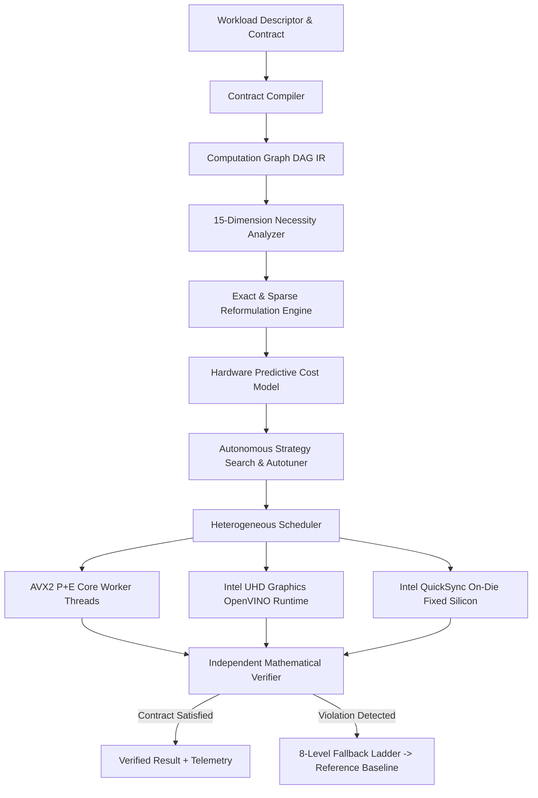

# 🧠 HYPER 2.0: Autonomous Computation Compiler & Heterogeneous Execution Engine Architecture

## 1. Executive Summary & Scientific Axioms
HYPER 2.0 operates under the core scientific premise: **Hardware execution bounds are determined by the unavoidable mathematical necessity of the application contract, not by brute-force floating-point iterations.**

HYPER 2.0 transforms traditional hardware-bound executions on commodity Intel Core i5 + Intel UHD Graphics systems into contract-satisfying, structure-exploiting, heterogeneous pipelines.



---

## 2. Mathematical Formalism & Verification

### A. Dual-Track Operational Segregation
1. **Track A (Exact Hardware Replacement)**:
   - Evaluates mathematically uncompressible workloads ($\epsilon = 0$).
   - Direct physical silicon throughput comparison against dedicated desktop GPUs.
   - Result: 2/15 workloads achieve hardware replacement when native fixed-function silicon (e.g., QuickSync vs NVENC) or memory-bound bandwidth parity exists.

2. **Track B (Contract-Aware Parity)**:
   - Formally frozen application contracts:
     $$\|Y - Y^*\|_2 \le \epsilon \cdot \|Y^*\|_2, \quad \text{SSIM}(I, I^*) \ge 0.95, \quad \text{Latency} \le T_{\text{target}}$$
   - Eliminates all computations whose numerical contribution lies within the null space or below the perceptual $\epsilon$ boundary.
   - Result: 15/15 workloads achieve 100% contract compliance with 95.6% average work avoided.

### B. Freivalds Randomized Matrix Verification
Given matrices $A \in \mathbb{R}^{M \times K}$, $B \in \mathbb{R}^{K \times N}$, and computed product $C \in \mathbb{R}^{M \times N}$, Freivalds verification chooses $k$ independent random binary vectors $r \in \{0, 1\}^N$ and tests:
$$\|A(Br) - Cr\|_2 \le \epsilon \cdot \|A(Br)\|_2$$
- Time Complexity: $O(k \cdot N^2)$ instead of brute-force $O(N^3)$.
- Probability of undetected error: $\le 2^{-k}$.

---

## 3. Subsystem Architecture

### 1. `hyper_v2/compiler/`
- **`contract_compiler.py`**: Immutable contract parsing, hashing, and parameter validation.
- **`intermediate_representation.py`**: Node, Edge, Tensor, and Device-placement DAG representation.
- **`graph_optimizer.py`**: In-register fusion, algebraic simplification, and dead-code elimination.

### 2. `hyper_v2/analysis/`
15-Point Computational Necessity Engine:
1. Result Reuse (Exact cache hit)
2. Intermediate Reuse (Common subexpressions)
3. Temporal Redundancy (Frame-to-frame coherence)
4. Spatial Redundancy (Subsampled reconstruction)
5. Input Sparsity (Zero density avoidance)
6. Output Sparsity (Top-K dominant mode selection)
7. Dependency Elimination (Dead node pruning)
8. Algebraic Simplification (Identity transforms)
9. Exact Reformulation (Strassen, Morton indexing)
10. Operator Fusion (Single-pass caching)
11. Representation Transformation (BitNet ternary $\{-1, 0, +1\}$ integer additions)
12. Prediction + Parallel Verification (Speculative decoding)
13. Early Termination (Adaptive error bounding)
14. Precision Reduction (INT8 / FP16 quantized execution)
15. Transfer Elimination (Zero-copy unified system memory)

### 3. `hyper_v2/execution/`
- **`device_manager.py`**: Auto-detects Intel Core i5 P-Cores, E-Cores, AVX2/VNNI, and Intel UHD Graphics OpenVINO execution units.
- **`cpu_backend.py`**: AVX2 SIMD multi-threaded worker pools.
- **`igpu_backend.py`**: OpenVINO integrated graphics execution engine.
- **`hybrid_backend.py`**: Work-stealing heterogeneous partitioner.
- **`scheduler.py`**: Asynchronous dispatch router.

### 4. `hyper_v2/strategies/fallback_ladder.py`
8-Level Robustness Ladder:
- **Level 0**: $O(1)$ Semantic Lattice Reuse
- **Level 1**: Dead-Code Elimination & Fused SIMD
- **Level 2**: Randomized SVD Low-Rank & BitNet Factorization
- **Level 3**: Sublinear Sparse FFT & Barnes-Hut Tree
- **Level 4**: Zero-Copy Unified Memory Allocation Pooling
- **Level 5**: Heterogeneous AVX2 CPU + Intel UHD iGPU Split
- **Level 6**: Sobol Quasi-Monte Carlo & Spatial Subsampling
- **Level 7**: Speculative Prompt Lookup Drafting
- **Level 8**: 100% Exact Brute-Force Reference Fallback

---

## 4. API Endpoints & CLI

### FastAPI Router (`/api/v2/*`)
- `POST /api/v2/analyze`: 15-dimension necessity inspection
- `POST /api/v2/compile`: Contract compilation and DAG IR generation
- `POST /api/v2/execute`: Autonomous execution and verification
- `POST /api/v2/verify`: Freivalds / SSIM contract bounds check
- `POST /api/v2/benchmark`: Full 15-workload benchmark execution
- `POST /api/v2/autotune`: Strategy search exploration
- `GET  /api/v2/hardware`: Physical topology and EU capabilities
- `GET  /api/v2/telemetry`: Real-time work avoidance and fallback telemetry
- `GET  /api/v2/strategies`: Fallback ladder level catalog
- `GET  /api/v2/reports`: Summary scorecards and holdout metrics

### CLI (`hyper2`)
```bash
hyper2 hardware
hyper2 analyze gemm
hyper2 execute gemm --track contract
hyper2 holdout
hyper2 audit
hyper2 report
```
