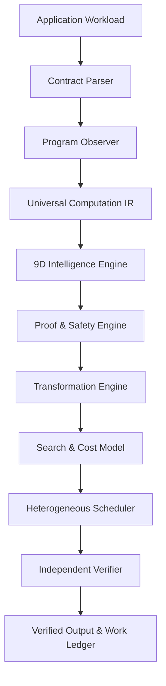

# HYPER 3.0: Architecture & Technical Specification

## 1. System Architecture
HYPER 3.0 implements a 10-stage autonomous cycle:
`OBSERVE -> UNDERSTAND -> MODEL -> PROVE -> TRANSFORM -> SEARCH -> EXECUTE -> VERIFY -> LEARN -> IMPROVE`

## 2. Core Modules
- **`hyper_v3.frontend`**: Contract Parser, Program Observer, Workload Loader.
- **`hyper_v3.ir`**: Universal DAG computation IR tracking FLOPs, memory reads/writes, dependencies.
- **`hyper_v3.intelligence`**: 9 dimensions of computational intelligence (Necessity, Redundancy, Structure, Sparsity, Reuse, Information, Complexity, Dependency, Bottleneck).
- **`hyper_v3.proof`**: Formal certificates, mathematical and contract invariants, error budget propagation.
- **`hyper_v3.transforms`**: Algebraic, loop, sparse, fusion, tiling, low-rank, and algorithmic transforms.
- **`hyper_v3.search`**: Beam search, evolutionary optimizer, hardware-calibrated cost model, strategy memory.
- **`hyper_v3.runtime`**: Device Manager, CPU SIMD, Intel UHD iGPU (OpenVINO), Hybrid partitioner, Asynchronous pipeline.
- **`hyper_v3.memory`**: Buffer residency tracker, buffer pools, 4-tier cache hierarchy (L1-L4), prefetcher.
- **`hyper_v3.verification`**: Segregated validator (Freivalds, SSIM, Symplectic Drift, Sobol).
- **`hyper_v3.learning`**: Micro-profiler, hardware models, online learning engine.
- **`hyper_v3.telemetry`**: Non-double-counting Computational Work Ledger.
