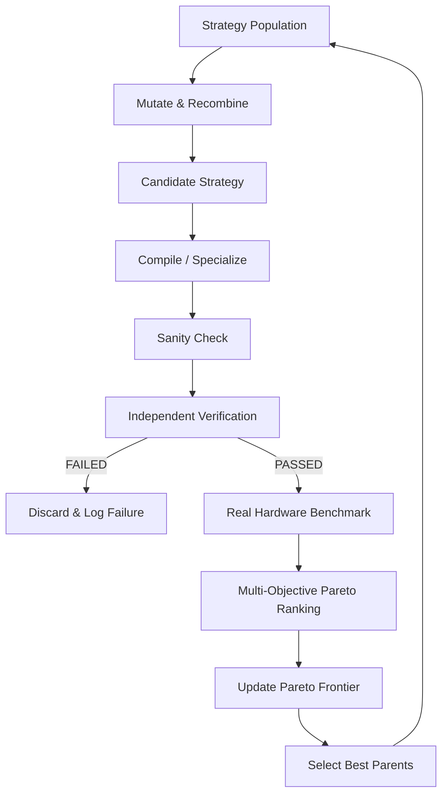

# HYPER Algorithm Discovery & Strategy Search

## 1. Beyond Fixed Heuristics
Static optimization passes only apply known code transformations. HYPER Algorithm Discovery treats computational strategy as an evolving genome:

```json
{
  "algorithm": "RandomizedSVD_BitNet",
  "representation": "Ternary_b1.58",
  "precision": "INT2_Packed",
  "tiling": [64, 64, 32],
  "fusion": ["MatmulBiasAdd", "GELUActivation"],
  "memory_plan": "ZeroCopy_SharedPool",
  "cpu_ratio": 0.70,
  "igpu_ratio": 0.30,
  "sampling": "Sobol_LowDiscrepancy",
  "verification": "Freivalds_Randomized"
}
```

---

## 2. The Evolutionary Discovery Loop



---

## 3. Multi-Objective Pareto Optimization

HYPER maintains a Pareto frontier across 6 non-fungible metrics:
1. **Latency** (ms to solution)
2. **Quality / Error** (PSNR, SSIM, relative residual)
3. **Total Work Done** (FLOPs + memory bytes)
4. **Peak Memory Footprint** (MB allocated)
5. **Energy / Thermal Cost** (estimated Joules)
6. **Verification Cost** (overhead of safety verification)

A candidate strategy is admitted only if it dominates the incumbent on at least one dimension without violating the contract.
