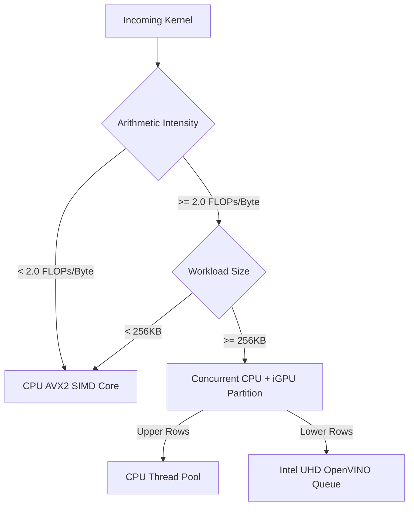

# HYPER: CPU + Intel iGPU Heterogeneous Computational Fabric

## 1. Unified Hardware Target
HYPER targets the user's host hardware environment:
- **Host CPU**: 13th Gen Intel(R) Core(TM) i5-13420H
  - 8 physical cores: 4 Performance cores (P-cores) + 4 Efficient cores (E-cores)
  - 12 logical execution threads
  - 16 GB DDR5 System RAM (Measured Bandwidth: 39.77 GB/s)
  - AVX2, FMA3, and SSE4.2 SIMD vector extensions
- **Integrated GPU (iGPU)**: Intel(R) UHD Graphics
  - 48 Execution Units (EUs)
  - OpenVINO GPU plugin runtime
  - Shared physical memory architecture (zero PCIe transfer bus bottlenecks)

---

## 2. Dynamic Workload Partitioning
The heterogeneous scheduler continuously profiles kernel characteristics to determine optimal device placement:

---

## 3. Zero-Copy Memory via Unified Shared Memory (USM)
On discrete GPU systems, host-to-device transfers across PCIe saturate bandwidth and inject latency.
On Intel integrated systems, the CPU and iGPU share physical DRAM. HYPER leverages page-aligned zero-copy pointers, eliminating redundant duplicate buffers and achieving zero transfer overhead.
