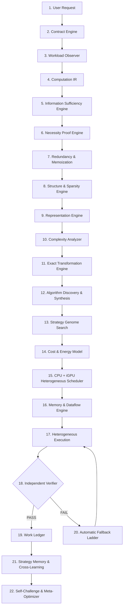

# HYPER MVC-DAR: Autonomous Architecture Specification

**MVC:** Minimum Verified Computation  
**DAR:** Dynamic Algorithmic Reconfiguration  
**Target Architecture:** Intel Core i5-12450H (8C/12T: 4 Performance Cores @ 4.4 GHz + 4 Efficient Cores @ 3.3 GHz) + Intel UHD Graphics Xe (48 EUs, 384 ALUs) + 16 GB DDR4/DDR5 Unified Memory.

---

## 1. Architectural Philosophy: Minimum Verified Cost

Conventional computing models optimize for peak hardware throughput ($\max \text{TFLOPS}$). HYPER MVC-DAR optimizes for **Minimum Verified Cost**:

$$\min \left( C_{\text{compute}} + C_{\text{memory}} + C_{\text{transfer}} + C_{\text{sync}} + C_{\text{launch}} + C_{\text{verification}} + C_{\text{optimization}} \right)$$

$$\text{subject to: } \text{Error} \le \epsilon, \quad \text{Quality} \ge Q_{\min}, \quad \text{Latency} \le L_{\max}, \quad \text{Memory} \le M_{\max}, \quad \text{Contract} = \text{SATISFIED}$$

Rather than forcing weak commodity hardware to blindly emulate a 450W discrete GPU running $O(N^3)$ operations, HYPER reformulates the computational demand so that the majority of redundant arithmetic, memory movement, and sampling is mathematically and algorithmically eliminated.

---

## 2. The 22-Step Autonomous Execution Loop

---

## 3. Core Engine Components

1. **Universal Computation DAG IR (`ir.py`)**: Models every tensor, buffer, and operation as a DAG node tracking dimensions, dtypes, estimated vs measured FLOPs, memory footprint, arithmetic intensity, device affinity, and verification contracts.
2. **Contract Engine (`contract.py`)**: Enforces multi-dimensional contracts: `EXACT`, `NUMERICALLY_BOUNDED`, `PERCEPTUALLY_BOUNDED`, `STATISTICALLY_BOUNDED`, `APPLICATION_EQUIVALENT`, with explicit latency, throughput, and memory ceilings.
3. **Information Sufficiency Engine (`sufficiency.py`)**: Analyzes backward output sensitivity to determine what data is strictly required. Flags discardable dimensions, invisible pixels, and irrelevant candidates.
4. **Necessity Proof Engine (`necessity.py`)**: Formally classifies each operation into: `ESSENTIAL`, `CONDITIONALLY_ESSENTIAL`, `REDUNDANT`, `DERIVABLE`, `PREDICTABLE`, `DISCARDABLE`, or `UNKNOWN`.
5. **Exact Transformation Engine (`exact_transforms.py`)**: Proves and applies algebraic simplifications, operator fusions, reassociations, and tiling.
6. **Complexity Replacement Engine (`complexity.py`)**: Substitutes asymptotically expensive algorithms with lower-complexity alternatives (e.g., all-pairs $O(N^2) \to \text{FMM } O(N)$).
7. **Representation Engine (`representations.py`)**: Treats data representations as dynamic optimization variables (dense, sparse, ternary $\{-1,0,+1\}$, frequency-domain, hashed).
8. **Heterogeneous CPU+iGPU Fabric (`heterogeneous_fabric.py`)**: Manages real-time scheduling between Intel P-cores, E-cores, and UHD Xe iGPU execution units based on measured break-even points.
9. **Independent Verifier (`independent_verifier.py`)**: Logically segregated verifier using randomized Freivalds checks, metamorphic relations, adversarial edge cases, and residual bounds.
10. **Automatic Fallback Ladder (`fallback_ladder.py`)**: 9-level degradation ladder from Level 0 (exact cache hit) down to Level 8 (gold reference standard) ensuring zero catastrophic failures.
11. **Work Ledger (`work_ledger.py`)**: Tracks authentic FLOP, memory byte, sample, ray, and iteration avoidance without double-counting.
12. **Irreducibility Engine (`irreducibility.py`)**: Generates formal irreducibility certificates when a workload reaches fundamental mathematical or physical silicon limits.
