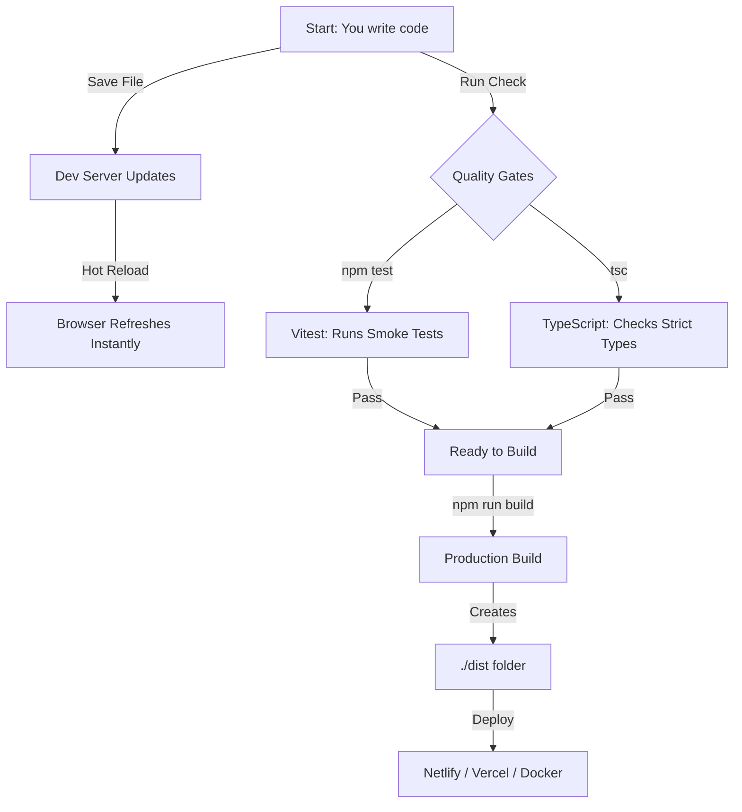
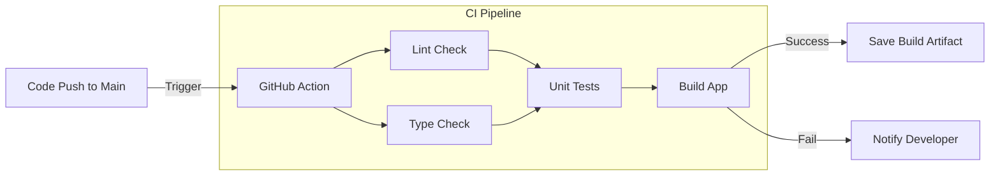
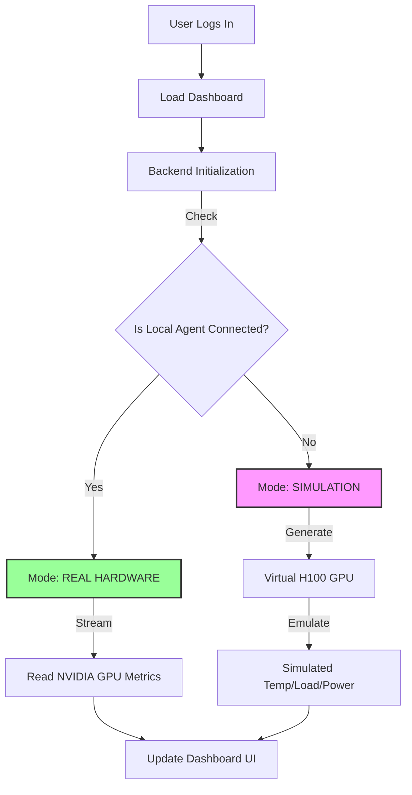

# Project Workflow Visualization

To help you understand exactly how **HYPER** works (both for developers and users), here are the visual workflows.

## 1. Developer Workflow (How to work on the project)
This is the cycle you follow to make changes, test them, and publish.

## 2. CI/CD Pipeline (GitHub Actions)
This happens automatically whenever you upload code to GitHub.

## 3. Application Logic (The "Honest" Engine)
How the app decides whether to use Real Hardware or the Simulation we built.

---
*Created for HYPER Documentation*
