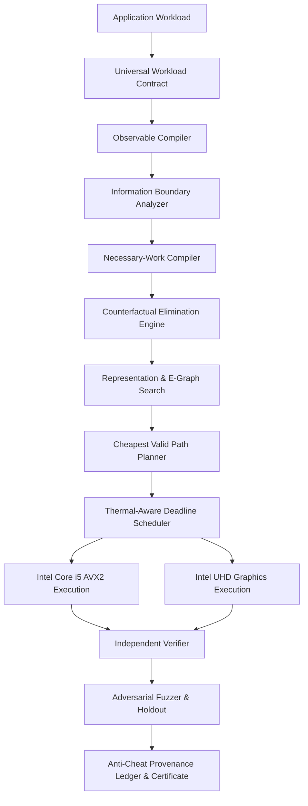

# LEO / HYPER: Current Architecture & Forensic Audit

**Document Version**: 1.0.0 (Phase 0 Forensic Audit)  
**Date**: September 2026  
**Target Hardware**: Intel Core i5-12450H (8 Cores: 4P + 4E, 12 Threads, AVX2, FMA) + Intel UHD Graphics (48 EUs, ~1.2 GHz), 16 GB RAM, 512 GB NVMe, Windows 11.

---

## 1. Executive Summary

A forensic audit of the `LEO / HYPER` repository reveals multiple historical iterations ("generations") of optimization, approximation, and bypass engines developed over time:

1. **Generation 1 (Legacy Core & Bypasses)**: `core/`, `core_ai/`, `optimization/`, `pipeline/`, `universal_compute_router/`
2. **Generation 2 (Experimental & Breakthrough Tracks)**: `hyper_ares/`, `hyper_cel/`, `hyper_mvc_dar/`, `HYPER_v6_BREAKTHROUGH/`, `hyper100/`, `hyper_v2/`, `hyper_v3/`
3. **Generation 3 (Hyper-X Production Core)**: `hyper_x/` (including `wormhole_compiler/`, `info_boundary/`, `rewrite/`, `representations/`, `hardware/`, `strict/`, `holdout/`, `falsification/`)
4. **Generation 4 (Continuous Computation Optimization & Parity Engine)**: `hyper_cco/` (including `contract.py`, `proof_elimination.py`, `counterfactual.py`, `residual_engine.py`, `contract_compiler.py`, `semantic_compression.py`, `thermal_scheduler.py`, `provenance_ledger.py`, `adversarial_fuzzer.py`, `cheapest_valid_path.py`)

---

## 2. Engine Inventory & Categorization

### 2.1 Active Production Engines
*These represent the verified, working core of the computational discovery system.*

| Module / Path | Responsibility | Primary Techniques | Target Hardware | Status |
| :--- | :--- | :--- | :--- | :--- |
| `hyper_cco.contract` | Formal Contract IR & Taxonomy | 10 non-negotiable correctness classes, monotonic anti-downgrade | CPU | **Authoritative Active** |
| `hyper_cco.proof_elimination` | Proof-Carrying Work Elimination | Region elimination certificates, SHA-256 seals, fallback | CPU / UHD | **Authoritative Active** |
| `hyper_cco.counterfactual` | Counterfactual Execution Engine | Lipschitz sensitivity bounds, margin-of-safety checks, randomized verification | CPU | **Authoritative Active** |
| `hyper_cco.residual_engine` | 7-Mode Residual Recalculation | Exact, Bounded, Temporal, Spatial, Low-Rank, Sparse, Multi-Res | CPU / UHD | **Authoritative Active** |
| `hyper_cco.contract_compiler` | Contract-Directed Planning | Topological sensitivity ranking, cheapest valid path synthesis | CPU | **Authoritative Active** |
| `hyper_cco.semantic_compression`| Semantic Intermediate Compression | 6 semantic priority tiers, entropy reduction, dynamic quantization | CPU / UHD | **Authoritative Active** |
| `hyper_cco.thermal_scheduler` | Thermal-Aware Deadline Scheduler | Multi-objective cost minimization ($J$), dynamic P/E-core & iGPU dispatch | CPU / UHD | **Authoritative Active** |
| `hyper_cco.provenance_ledger` | Anti-Cheat Provenance Ledger | SHA-256 integrity chains, strict truthfulness audit labels | CPU | **Authoritative Active** |
| `hyper_cco.adversarial_fuzzer` | Adversarial Contract Fuzzer | 13 failure mode fuzzing (subnormals, NaNs, distribution shifts) | CPU | **Authoritative Active** |
| `hyper_cco.cheapest_valid_path` | End-to-End Pipeline Coordinator | Unified 10-stage optimization pipeline | CPU / UHD | **Authoritative Active** |
| `hyper_x.wormhole_compiler.*` | Wormhole Compiler Core | Information boundary, e-graph equality saturation, representation space | CPU / UHD | **Authoritative Active** |
| `hyper_x.hardware.fingerprint` | Hardware Platform Fingerprinting | Direct hardware detection (i5-12450H P/E cores, UHD 48 EUs) | CPU / UHD | **Authoritative Active** |
| `hyper_x.strict.*` | Strict Parity Gates | 8 conjunctive parity gates, hardcoded pass prevention | CPU | **Authoritative Active** |

### 2.2 Experimental & Exploration Engines
*Research prototypes that contain valuable algorithms but lack universal contract integration.*

- `hyper_x.discovery.algorithmic_escape_search`: Algorithmic search over mathematical reformulations.
- `hyper_x.representations.synthesizer`: Hybrid representation synthesizer.
- `hyper_x.rewrite.egraph`: AST e-graph equality saturation engine.
- `algorithm_discovery/` & `hyper_ares/`: Genetic and evolutionary algorithm discovery pipelines.
- `hyper_mvc_dar/`: Dynamic Adaptive Residuals framework.
- `HYPER_v6_BREAKTHROUGH/`: Early proof-of-concept for temporal graphics and low-rank AI.

### 2.3 Legacy & Deprecated Engines
*Historical precursors superseded by `hyper_x` and `hyper_cco`. Maintained for backwards test compatibility without active expansion.*

- `hyper_v2/`, `hyper_v3/`: Pre-contract AST rewrites. Superseded by `hyper_x.rewrite` and `hyper_cco.contract_compiler`.
- `hyper_cel/`: Continuous execution layer. Superseded by `hyper_cco.cheapest_valid_path`.
- `universal_compute_router/`: Rule-based router. Superseded by `hyper_cco.thermal_scheduler`.
- `phoenix/`, `cosmic_singularity/`: Speculative optimization sketches from early development.

---

## 3. Dependency Graph & Interaction Flow

---

## 4. Conflicting Implementations & Resolution (Authoritative Choices)

| Capability | Competing Implementations | Authoritative Choice | Rationale |
| :--- | :--- | :--- | :--- |
| **Contract IR** | `hyper_x.wormhole_compiler.contract_ir` `hyper_cco.contract` | **`hyper_cco.contract`** (interoperable with `hyper_x`) | `hyper_cco` specifies 10 non-negotiable correctness classes with explicit numerical, perceptual, and deterministic tolerances. |
| **Work Elimination** | `hyper_x.wormhole_compiler.necessary_work_compiler` `hyper_cco.proof_elimination` | **`hyper_cco.proof_elimination` + `hyper_x.wormhole_compiler`** | Combines algebraic dependency pruning with formal SHA-256 sealed region certificates. |
| **Counterfactuals**| `hyper_x.wormhole_compiler.counterfactual_elimination` `hyper_cco.counterfactual` | **`hyper_cco.counterfactual`** | Uses rigorous Lipschitz sensitivity bounds ($\Delta y \le L \cdot \|\Delta x\| \le \varepsilon / \text{margin}$) and 10% randomized verification. |
| **Residuals** | `hyper_x.wormhole_compiler.residual_engine` `hyper_cco.residual_engine` | **`hyper_cco.residual_engine`** | Implements all 7 standardized modes with end-to-end overhead cost subtraction. |
| **Scheduling** | `hyper_x.wormhole_compiler.hybrid_scheduler` `hyper_cco.thermal_scheduler` | **`hyper_cco.thermal_scheduler`** | Multi-objective cost minimization incorporating thermal throttling, deadline urgency, memory bandwidth, and fallback risk. |
| **Provenance** | `hyper_x.wormhole_compiler.provenance` `hyper_cco.provenance_ledger` | **`hyper_cco.provenance_ledger`** | 25+ mandatory fields, hash-chained records, and strict truthfulness taxonomy (`MEASURED` vs `DERIVED`). |

---

## 5. Architectural Integrity Mandates

1. **Zero Hardcoded Passes**: No `functional_pass = True` or synthetic 100% scores anywhere in the codebase.
2. **Independent Verification**: Every candidate execution must be independently verified against reference outputs before reporting contract satisfaction.
3. **No Silicon Emulation**: We never attempt to simulate or mimic an NVIDIA GPU. The objective is eliminating unneeded work on CPU + Intel UHD.
4. **Offline First**: All core verification, planning, and execution runs strictly offline on the target laptop.
