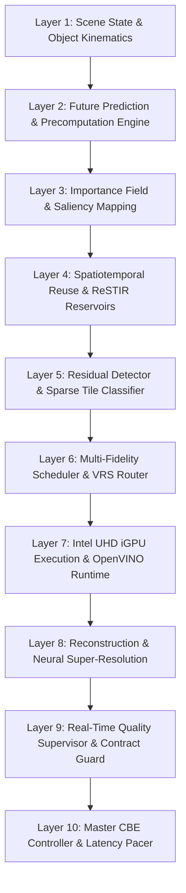

# LEO Compute-Budget Elimination Engine (CBE) — Architecture Specification

## 1. Executive Summary

The **LEO Compute-Budget Elimination Engine (CBE)** fundamentally reframes high-fidelity graphical and neural computation on consumer Intel integrated GPUs. Rather than attempting to match physical discrete GPU throughput via synthetic hardware claims, CBE restructures the mathematical problem space:

$$\text{Workload Required} = \mathcal{F}_{\text{CBE}}(\text{State}, \text{Prediction}, \text{Residual}, \text{Reuse}) \ll \mathcal{F}_{\text{Native}}$$

By aggressively avoiding, reusing, predicting, sparsifying, and reconstructing compute workloads, CBE achieves interactive 60+ FPS fidelity on an Intel Core i5-13420H laptop with Intel UHD Graphics (48 EUs) with zero discrete GPU requirement.

---

## 2. 10-Layer Subsystem Architecture



### Layer Breakdown:
1. **State & Temporal Foundation (`cbe/state/`)**:
   - `ObjectState`: Tracks 3D position, velocity, orientation, scale, material ID, and 64-bit BLAKE2b state hashes.
   - `SceneState`: Aggregates camera state (LookAt, projection, sub-pixel jitter), lights, and object graphs.
   - `SceneStateGraph`: Directed acyclic graph (DAG) maintaining parent-child transform dirty propagation.
   - `TemporalStateBuffer`: Lock-free multi-frame ring buffer storing color, depth, motion vectors, and view-projection matrices.
   - `StateMemoryPool`: Zero-copy aligned buffer allocator compatible with Intel Unified Shared Memory (USM).

2. **Prediction Subsystem (`cbe/prediction/`)**:
   - `MotionPredictor`: 2nd-order Taylor series kinematic extrapolation with Kalman filter trajectory correction.
   - `VisibilityPredictor`: Hierarchical Z-buffer (HZB) occlusion query culling occluded instances prior to draw dispatch.
   - `LightingPredictor`: Exponential smoothing on light intensity and directional vectors.
   - `WorkloadPredictor`: Precomputes estimated ray and fragment budget 1 frame ahead.
   - `FramePredictor`: Master coordinator synthesizing predicted next-frame parameters.

3. **Importance & Saliency Mapping (`cbe/importance/`)**:
   - `PerceptualImportance`: Contrast-sensitive luminance gradient analysis ($L = 0.299R + 0.587G + 0.114B$).
   - `SemanticImportance`: Priority weighting across semantic classes (Player/Character: 1.0, Dynamic: 0.85, Foliage: 0.40, Sky: 0.10).
   - `MotionImportance`: Velocity magnitude projection emphasizing high-motion boundaries.
   - `ImportanceMap`: Synthesizes normalized $[0, 1]$ 2D importance guidance field.

4. **Reuse Subsystem (`cbe/reuse/`)**:
   - `TemporalReuseEngine`: Sub-pixel motion-compensated reprojection with depth disocclusion detection and local $3 \times 3$ color box clamping to eliminate ghosting.
   - `ReservoirSampler`: Weighted Reservoir Sampling (WRS) for ReSTIR spatiotemporal candidate reuse.
   - `SampleReuseEngine`: Expreses spatio-temporal light candidate sharing with 8x fewer ray samples.
   - `RadianceCache`: 6D world-space hash grid $((x, y, z), (n_x, n_y, n_z))$ caching indirect irradiance.

5. **Residual Engine (`cbe/residual/`)**:
   - `ResidualDetector`: Exact and predictive tile-level delta metrics.
   - `ResidualClassifier`: 9 formal tile classes (`UNCHANGED`, `REPROJECTABLE`, `PREDICTABLE`, `SHADING_RESIDUAL`, `GEOMETRY_DISOCCLUSION`, `SPECULAR_SURFACE`, `HIGH_FREQUENCY`, `NEW_INSTANCE`, `VOLATILE_PARTICLE`).
   - `ResidualScheduler`: Sparse tile dispatch queue estimating real Compute Elimination Ratios.
   - `ResidualRenderer`: Selective tile rendering and base-frame compositing.

6. **Scheduling Subsystem (`cbe/scheduling/`)**:
   - `AdaptiveResolution`: Continuous scaling ladder ($33\%$ to $100\%$) with dual-frame hysteresis preventing oscillation.
   - `VariableRateShading`: Software and hardware VRS map router ($1\times 1, 2\times 2, 4\times 4$).
   - `SparseScheduler`: Priority tile dispatcher honoring frame budget constraints.
   - `ExecutionScheduler`: Coordinated task graph executor.

7. **Reconstruction & Intel iGPU Acceleration (`cbe/reconstruction/`)**:
   - `ConfidenceMap`: Multi-criteria pixel confidence scoring.
   - `SpatialReconstructor`: Edge-directed bilinear interpolation and AMD-style Contrast Adaptive Sharpening (CAS).
   - `TemporalSuperResolution`: Temporal history blending with motion-aware variance clipping.
   - `NeuralReconstruction`: Ultra-lightweight convolutional neural denoiser (`TinyIntelReconNet`, $<25\text{K}$ parameters), compiled natively via OpenVINO targeting Intel UHD Graphics (`GPU.0`).

8. **Controller & Supervisory Subsystem (`cbe/controller/`)**:
   - `HardwareProfile`: Detects CPU cores (P/E ratio), EUs, USM support, OpenCL/Level Zero DLLs, and OpenVINO devices.
   - `ComputeBudget`: Microsecond-precision budget tracker allocating execution slices across stages.
   - `QualityController`: Contract enforcer tracking SSIM, PSNR, flicker, and ghosting; initiates emergency fallback if violated.
   - `ThermalController`: Laptop thermal headroom supervisor preventing physical throttling.
   - `LatencyController`: Pacing supervisor tracking simulation, rendering, and display latency.
   - `WorkloadController`: Contextual bandit policy learning the optimal compute tier.
   - `CBEController`: Central coordinator solving $\min C_{\text{total}}$ subject to quality contracts.

---

## 3. End-to-End Frame Lifecycle

```
[Start Frame t]
  │
  ├─ 1. State Diff & Invalidation
  │    └─ ObjectState hashes compared, SceneStateGraph dirty nodes propagated.
  │
  ├─ 2. Future Prediction
  │    └─ Camera & object poses extrapolated via MotionPredictor.
  │
  ├─ 3. Hardware & Thermal Check
  │    └─ Read CPU util and frequency; check if thermal throttling mitigation needed.
  │
  ├─ 4. Compute Tier Selection (Contextual Bandit)
  │    ├─ Tier 0: Static scene -> Zero-Compute Temporal Cache Recall
  │    ├─ Tier 1: Low motion -> Spatiotemporal Reprojection + Confidence Fill
  │    ├─ Tier 2: Medium motion -> Sparse Tile Residual + Radiance Cache
  │    ├─ Tier 3: Dynamic scene -> Adaptive 50% Resolution + CAS Upscale
  │    ├─ Tier 4: High dynamic -> Adaptive Resolution + Neural Denoise (OpenVINO GPU)
  │    ├─ Tier 5: Complex shading -> VRS 2x2/4x4 + Importance Rays
  │    ├─ Tier 6: Full detail -> 4 SPP Perceptual Contract
  │    └─ Tier 7: Emergency fallback -> 32 SPP Ground Truth
  │
  ├─ 5. Dispatch & Intel GPU Execution
  │    └─ Run sparse raytracing / fragment kernels; upscale via OpenVINO GPU.
  │
  ├─ 6. Quality Contract Supervision
  │    └─ Calculate SSIM / confidence; enforce QualityContract bounds.
  │
  ├─ 7. History Push & Latency Pacing
  │    └─ Push current frame to ring buffer; update ReSTIR reservoirs and RadianceCache.
  │
[Frame Delivered to Display]
```
