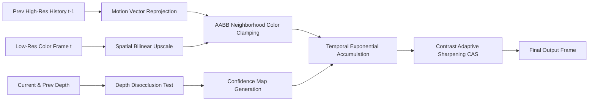

# LEO CBE — Temporal Super-Resolution & Reconstruction Specification

## 1. Motivation: Beyond Naive Pixel Duplication

Early prototypes often attempt spatial scaling via `np.repeat()` or nearest-neighbor duplication, resulting in heavy pixelation, temporal shimmering, and high reconstruction error.

The **LEO CBE Temporal Super-Resolution (TSR)** subsystem replaces naive duplication with a mathematically grounded spatiotemporal reconstruction pipeline combining motion-compensated reprojection, depth-guided disocclusion detection, local color bounding box clamping, and Contrast-Adaptive Sharpening (CAS).

---

## 2. Algorithmic Pipeline

### 2.1 Motion-Compensated Reprojection
For each pixel at high-resolution coordinate $(x_t, y_t)$ in frame $t$, the motion vector $\mathbf{v} = (\Delta x, \Delta y)$ points back to its location in the previous frame:
$$(x_{t-1}, y_{t-1}) = (x_t - \Delta x, \; y_t - \Delta y)$$

The historical color is sampled using 4-tap bilinear interpolation with bound clamping to prevent edge bleeding.

### 2.2 Depth-Guided Disocclusion Testing
When an object moves, it uncovers previously occluded background surfaces. Naively sampling the history frame across these regions introduces severe trailing artifacts. The disocclusion operator tests depth continuity:

$$\text{is\_disoccluded} = \left( \frac{|z_t(x_t, y_t) - z_{t-1}(x_{t-1}, y_{t-1})|}{\max(|z_t(x_t, y_t)|, 10^{-4})} > 0.05 \right)$$

Disoccluded pixels have their confidence set to $0.0$, forcing immediate refresh from current frame data.

### 2.3 AABB Color Box Clamping (Ghosting Suppression)
Even in non-disoccluded regions, changes in specular reflection or lighting can cause historical colors to persist inappropriately (ghosting). CBE computes the local $3 \times 3$ neighborhood min and max in color space:

$$\mathbf{m}_{\text{min}} = \min_{(dx, dy) \in \{-1, 0, 1\}^2} I_{\text{curr}}(x + dx, y + dy)$$
$$\mathbf{m}_{\text{max}} = \max_{(dx, dy) \in \{-1, 0, 1\}^2} I_{\text{curr}}(x + dx, y + dy)$$

The reprojected color is strictly clamped to this bounding box:
$$I_{\text{clamped}} = \text{clip}(I_{\text{reproj}}, \; \mathbf{m}_{\text{min}}, \; \mathbf{m}_{\text{max}})$$

### 2.4 History Accumulation & CAS Sharpening
Stable pixels are blended with an exponential moving average weight $\alpha = 0.85$:
$$I_{\text{accum}} = \alpha I_{\text{clamped}} + (1 - \alpha) I_{\text{curr}}$$

Finally, Contrast Adaptive Sharpening (CAS) restores crisp high-frequency edge definition without introducing ringing or overshoot halos.
