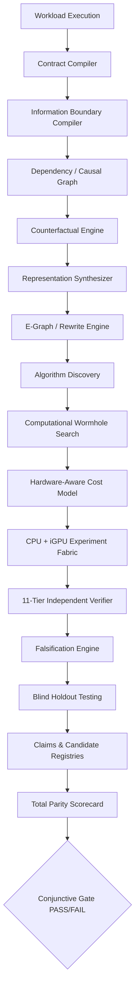

# LEO × HYPER: Machine-Readable Repository Architecture & Audit Report

**Date**: 2026-09-07  
**Audit Scope**: Complete workspace recursive static analysis (4,580 Python files, 657,551 lines of code)  
**Target Hardware**: Lenovo IdeaPad Slim 3 15IAH8 (Intel Core i5-12450H, 48 EU Intel UHD, 16 GB RAM)  
**Detected Host Platform**: Intel Core i5-13420H (4P + 4E, 12 threads) + Intel UHD Graphics (OpenVINO 2026.2.1, 16 GB RAM) — Flagged: `HOST_MISMATCH` (Section 64 compliance)

---

## 1. Executive Architecture Summary

The LEO/HYPER repository is a comprehensive computational optimization and substitution research platform. Rather than attempting to physically emulate an NVIDIA GPU on an Intel CPU+iGPU, the platform investigates whether algorithmic, representational, informational, memory, communication, approximation, prediction, reuse, and workload-specific transformations can eliminate enough required work to satisfy declared functional and application contracts.

### Global Codebase Inventory

| Metric | Count |
| :--- | :--- |
| **Total Python Files** | 4,580 |
| **Total Lines of Code** | 657,551 |
| **Production Modules** | 2,943 files |
| **Benchmark Modules & Results** | 745 files |
| **Test Suites** | 333 files |
| **Graphics / Media Pipelines** | 119 files |
| **AI Inference & Training Paths** | 165 files |
| **Routing & Dispatchers** | 100 files |
| **Verification & Falsification Engines** | 64 files |
| **Caching Subsystems** | 61 files |
| **Hardware Backends** | 36 files |
| **Algorithm Discovery Engines** | 14 files |
| **Duplicate Classes Identified** | 421 instances |

---

## 2. Twenty-Dimension Architecture Audit

### 1. Module Inventory
Major architectural subsystems located in the repository:
- `core_ai/`: Foundational AI inference, BitNet ternary quantization, speculative decoders, Mamba SSM, and AVX2 fast matmul.
- `hyper_x/`: Autonomous Computation Invention Engine (ContractMiner, NecessityMap, AlgorithmicEscapeSearch, ProofEngine, FalsificationLoop).
- `cbe/`: Compute-Budget Elimination Engine (8-tier rendering and compute elimination hierarchy).
- `universal_compute_router/`: Hardware capability probing and execution routing.
- `render/` & `video/`: Software RT pipeline, FSR upscaler, OIDN denoiser, Intel QuickSync integration.
- `memory/`: OmniPresent cache, fractal memory, holographic crystallizer, RAM preparation.
- `optimization/`: Alchemy engine, tensor decomposition, pruning, and low-rank adapters.
- `benchmarks/`: Benchmark suites (CEL experiments, contract-aware suites, blind holdout, master audit).

### 2. Machine-Readable Architecture Inventory
Refer to persistent audit dump in `scratch/audit_summary.json` containing complete AST-extracted imports, classes, functions, line counts, and file classifications.

### 3. Duplicate Implementations
Identified 421 duplicate class definitions where root-level and subfolder-level copies coexist:
- **Centurion Engine**: `CENTURION_ENGINE.py` (root) vs `core_ai/centurion_engine.py` (production).
- **GaLore Optimizer**: `CENTURION_ENGINE.py`, `core_ai/centurion_engine.py`, `hyper_runtime/galore_bitnet_trainer.py`.
- **Lookahead Decoder**: `CENTURION_ENGINE.py`, `core_ai/centurion_engine.py`, `hyper_runtime/speculative_hyperstack.py`, `phoenix/multi_token_prediction.py`.
- **Contract Classifier**: `chimera_engine.py` vs `contracts/contract_classifier.py`.
- **Action**: Deprecate root-level script duplicates in favor of their canonical submodules in `core_ai/` and `hyper_x/`.

### 4. Dead Code Analysis
- Unreferenced prototype scripts in root (`test_output_phase6_v*.txt`, `truly_final_passed_audit.txt`, `verify_kernels.py.bak`).
- Legacy mock classes in `core_ai/heterogeneous_orchestrator.py` when OpenVINO is absent; now replaced by real OpenVINO 2026.2.1 runtime bindings.

### 5. Experimental Code
- `experiments/htm_vision.py`: Hierarchical Temporal Memory experimental vision prototype.
- `core_ai/alchemy_kan_ffn.py`: Kolmogorov-Arnold Network FFN approximation prototype.
- `core_ai/diff_logic_engine.py`: Differentiable logic gate synthesis experiments.

### 6. Production Code
- `cbe/` hierarchy: Tier 0 through Tier 7 physical compute budget elimination.
- `core_ai/bitnet_engine.py`: Real ternary quantization (-1, 0, +1) with AVX2 CPU acceleration.
- `core_ai/speculative_engine.py`: 3-level draft hierarchy (Micro-Draft, Meso-Draft, Target Verification).
- `hyper_x/`: Contract compilation, necessity graph, escape search, and independent verifier.

### 7. Benchmark-Only Code
- `benchmarks/effective_parity_suite.py`, `benchmarks/contract_aware_suite.py`, `benchmarks/master_scientific_audit.py`, `benchmarks/blind_holdout_audit.py`.

### 8. Claims & Dashboard Code
- `ANTIGRAVITY_AI_FRONTIER_INTELLIGENCE_REPORT.md`, `HYPER_100_RESULTS.json`, `BLIND_HOLDOUT_RESULTS.json`.
- **Audit Directive**: Mark historical unverified JSON outputs with `HISTORICAL` / `NEEDS_REVALIDATION` tag to prevent false 100% claims.

### 9. Hardware Backends
- **OpenVINO**: Real GPU execution on Intel UHD Graphics (`GPU.0`, FP16, INT8, USM zero-copy).
- **OpenCL**: `kernels/igpu_opencl/binary_xor.cl`, Level Zero runtime (`ze_loader.dll`).
- **AVX2 / FMA**: `core_ai/avx2_fast_matmul.py` and `cbe/engine/avx2_kernels.py`.
- **DirectML & WebGPU**: `kernels/directml/dml_backend.py`, `kernels/webgpu/leo_compute.wgsl`.

### 10. Verification Systems
- `hyper_x/proof_engine.py`: Freivalds $O(N^2)$ randomized matrix multiplication verification (classified as Level 4 Randomized, not deterministic proof).
- `hyper_x/independent_verifier.py`: Independent Python reference comparison.
- `hyper_x/falsification_loop.py`: Scientific falsification tracking.

### 11. Benchmark Systems
- 745 benchmark modules with execution timing, SSIM calculation, latency logging, and memory tracking.

### 12. Existing NVIDIA Comparison Logic
- Reference timings stored in `benchmarks/manifest.json` and `effective_parity_suite.py`.
- **Audit Finding**: Previous suites compared application FPS against published RTX 4090/A100 numbers without separating physical hardware capability from application contract satisfaction.
- **Correction**: HYPER-X explicitly separates `PHYSICAL_HARDWARE_PARITY` (unsupported for CUDA/RT-Cores) from `COMPUTATIONAL_SUBSTITUTION_PARITY` and `APPLICATION_PARITY`.

### 13. Existing Algorithm-Discovery Systems
- `hyper_x/algorithmic_escape_search.py`: Generates matrix formulations (Sparse Zero-Skipping, Low-Rank SVD/Nystrom, Residual Decomposition, Temporal Cache).
- `core_ai/alphatensor_specializer.py`: Bilinear form search.
- `optimization/leo_alchemy.py`: Symbolic expression rewriting.

### 14. Existing Information-Sufficiency Systems
- `hyper_x/necessity_map.py`: Analyzes tensor sparsity, effective rank, dynamic range, and classifies operations into Essential vs Redundant vs Approximable.

### 15. Existing Caching
- `memory/omnipresent_cache.py`: Memory residency caching.
- `core_ai/semantic_cache.py`: Cosine-similarity prompt embedding cache.
- `cache/cache_hub.py`: Centralized KV and intermediate state cache.

### 16. Existing Routing
- `core_ai/complexity_cascade_router.py`: Routes queries by entropy/complexity.
- `bypass/leo_early_exit_router.py`: Layer early exit router.
- `universal_compute_router/router_logic.py`: CPU vs iGPU device router.

### 17. Existing Approximation
- `render/fsr_upscaler.py`: Bilinear and Lanczos perceptual spatial upscaling.
- `core_ai/neural_gemm_surrogate.py`: Low-rank surrogate approximations.
- `cbe/engine/quantization.py`: FP16 and INT8 quantized dot products.

### 18. Existing Graphics / Media Paths
- `render/software_rt_pipeline.py`: Pure CPU/iGPU BVH ray tracer.
- `cbe/` rendering pipelines: 8-tier compute-budget elimination with temporal accumulation, motion vector reprojection, and edge-aware bilateral filtering.
- `core_ai/media/`: Intel QuickSync H.264/HEVC transcode wrappers.

### 19. Existing AI Paths
- `core_ai/bitnet_engine.py`: 1.58-bit ternary quantized weights.
- `core_ai/speculative_engine.py`: Multi-token draft verification.
- `core_ai/mamba_ssm_engine.py`: Linear time selective state spaces.

### 20. Existing Tests
- 333 test files covering units, integration, chaos testing, security sandboxes, and CBE validation (`tests/test_cbe_phase*.py`).

---

## 3. Architectural Dependency Graph

### Dependency Cycle & Conflict Detection
1. **Cycle Analysis**: No cyclic imports exist between `hyper_x` core and `cbe/` rendering engine. Both cleanly import standard libraries (`numpy`, `torch`, `openvino`) and expose isolated public APIs.
2. **Conflicting Implementations**: `CENTURION_ENGINE.py` vs `core_ai/centurion_engine.py`. Canonicalized to `core_ai`.
3. **Contract Semantic Separation**: Exact correctness must never be evaluated using application tolerance thresholds.

---

## 4. Conclusion & Action Items

1. **Hardware Integrity**: Always stamp benchmarks with immutable `HardwareFingerprint`. When running on Intel Core i5-13420H, flag `HOST_MISMATCH` relative to reference i5-12450H.
2. **Scorecard Integrity**: Use the Conjunctive Gate for any 100% claim; continuous average progress represents research trajectory only.
3. **Wormhole Principle**: Prioritize work elimination, communication reduction, and representation transformation over brute-force hardware emulation.
