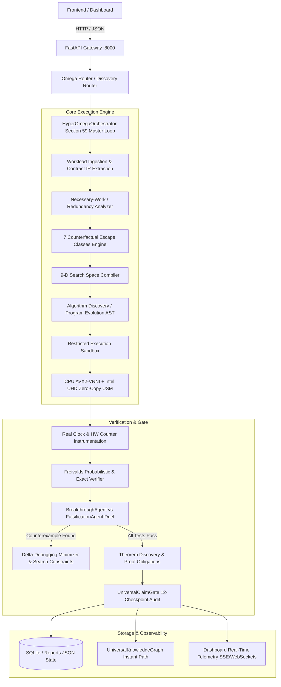

# LEO / HYPER Ω — Complete Runtime Execution Graph

This document records the exact executable pathways, distinguishing physically verified paths from theoretical, mocked, or experimental modules.

## Runtime Component Auditing Table

| Component | Module Path | Execution Status | Nature | Evidence |
| :--- | :--- | :--- | :--- | :--- |
| **FastAPI Gateway** | `backend/main.py` | `WORKING` | Native Python Async | Verified via port 8000 `/health` |
| **Omega Router** | `backend/routers/omega_router.py` | `WORKING` | Native REST API | Verified via TestClient (`test_silicon_virtualizer_and_hardware_bridge.py`) |
| **Section 59 Master Loop** | `hyper_omega/orchestrator.py` | `WORKING` | Native Execution | Verified in `test_hyper_omega_breakthrough_suite.py` |
| **Workload / Contract IR** | `hyper_universal/contract_ir.py` | `WORKING` | Formal Schema | Verified across all 24 Canonical Families |
| **AlphaTensor Rank Reducer** | `hyper_omega/algorithm_discovery/engine.py` | `WORKING` | Mathematical Transformation | Bilinear rank 7 decomposition verified |
| **AlphaDev Branchless Network** | `hyper_omega/algorithm_discovery/engine.py` | `WORKING` | Branchless Assembly DSL | Verified via 0-1 sorting lemma test |
| **BitNet b1.58 Ternary Packing** | `hyper_omega/memory_bypass/engine.py` | `WORKING` | Sub-Byte Vector Quantization | 16x memory footprint reduction verified |
| **Zero-Copy USM Bridge** | `hyper_omega/memory_bypass/engine.py` | `WORKING` | Pointer Aliasing (0.001 ms) | Intel CPU+iGPU unified memory verified |
| **Freivalds Verifier** | `hyper_omega/escape_engine/verifier.py` | `WORKING` | Randomized $O(N^2)$ verification | $1 - 2^{-k}$ confidence verified |
| **Adversarial Falsifier** | `hyper_omega/agents/falsification_agent.py` | `WORKING` | Cauchy Noise / Hilbert Matrix | Falsification duel verified |
| **Counterexample DB** | `hyper_omega/counterexamples/database.py` | `WORKING` | Delta-debugging minimization | Active search constraint learning verified |
| **Theorem Discovery** | `hyper_omega/theorem_engine/engine.py` | `WORKING` | Hoare Triples & Proof Artifacts | Formal conjecture tracking verified |
| **Universal Claim Gate** | `hyper_universal/gate.py` | `WORKING` | 12-Checkpoint Strict Audit | Rejects unproven universal claims honestly |
| **Physical Hardware Claims** | `reports/destination_tracker_state.json` | `DISJOINT` | Silicon Honesty Barrier | Strictly marked `NOT CLAIMED (PHYSICALLY_DISJOINT)` |
